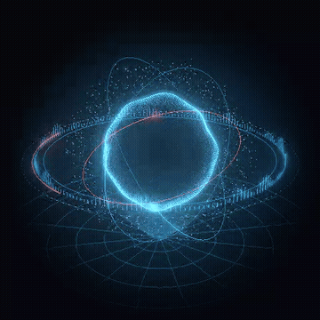

# Holocore

A light, open-source holographic orb for AI and voice agents.

- **Lite**: Canvas 2D with zero dependencies, one file from a CDN.
- **WebGL**: the full hologram, on three.js.
- No framework required. A React wrapper for those who want one.



**Try it in the lab: [holocore-lab.vercel.app](https://holocore-lab.vercel.app)**

```bash
npm i holocore-ui
```

| Mode | Entry | Size, minified and gzipped |
| --- | --- | --- |
| Lite | `holocore-ui/lite` | 4.5 kB |
| WebGL | `holocore-ui/webgl` | 133.4 kB, three.js included |

Sizes measured on 30 September 2026 with `npm run size`. To see the frame rate
on your own device, open the lab with `?fps` at the end of its address. See
[Measuring](#measuring) to reproduce the sizes.

## Quick start

### Lite, from a CDN, no build step

```html
<div id="orb" style="width: 320px; height: 320px"></div>
<script type="module">
  import { mount } from "https://cdn.jsdelivr.net/npm/holocore-ui@next/dist/cdn/holocore-lite.min.js";
  const orb = mount(document.getElementById("orb"), { theme: "holo" });
</script>
```

### Lite, from npm

```js
import { mount } from "holocore-ui/lite";

const orb = mount(document.getElementById("orb"), { theme: "holo", rings: 3 });
orb.update({ level: 0.6 }); // a voice level from 0 to 1, as often as you like
orb.destroy();
```

### WebGL

```bash
npm i holocore-ui three
```

```js
import { mount } from "holocore-ui/webgl";

const orb = mount(document.getElementById("orb"), { engine: "auto", theme: "holo" });
console.log(orb.engine); // "webgl", or "lite" where WebGL is not available
```

`engine` is `"auto"` (the default: WebGL where it works), `"webgl"` (the
same, and the lite orb where WebGL is refused) or `"lite"`. The package never
reads the URL. WebGL mode adds its light to the page behind it, so it is made
for a dark background; lite works on any.

### React

```jsx
import { Holocore } from "holocore-ui/react";

// The lite orb, no three.js needed:
<Holocore theme="holo" level={level} />

// With WebGL (install three too):
<Holocore theme="holo" level={level} webgl={() => import("holocore-ui/webgl")} />
```

The lite orb shows at once. Given the `webgl` loader, it hands over to WebGL
once three.js has loaded and drawn its first frame; without it, your bundle
never references three. In the Next.js App Router, render it from a client
component (`"use client"`).

## Options

| Option | Values | Default | |
| --- | --- | --- | --- |
| `theme` | `"neutral"`, `"holo"`, `"mono"`, or `{ preset, core, rim, accent, glow, ground }` | `"neutral"` | Colour roles in hex. An object replaces the roles it names in its preset. |
| `rings` | 0 to 8 | 3 | Rings around the core, each on its own plane. |
| `activity` | `"calm"`, `"busy"` | `"calm"` | Busy lights a third of the rings in the accent colour and speeds them up. |
| `level` | 0 to 1 | 0 | The voice level. The orb smooths it (fast attack, slower release), clamps it, and ignores anything that is not a number. |
| `reducedMotion` | `true`, `false` | the visitor's `prefers-reduced-motion` | No spin; the level becomes a still intensity, redrawn when it changes. Read at mount. |

`mount(container, options)` makes its own canvas inside `container`, which
needs a size. It returns:

- `update(options)`: change any option but `reducedMotion`, as often as you like;
- `destroy()`: stops every frame, listener and observer; in WebGL mode it also
  frees geometries, textures and the renderer and releases the context, so
  you can mount again as often as you like;
- `frames()`: frames drawn so far. The container also carries
  `data-holocore-engine` and `data-holocore-frames`;
- `engine`: the engine drawing. To change it, `destroy()` then `mount()`.

Drag the orb to spin it, with inertia; at rest it turns slowly on its own.
The canvas is hidden from assistive technology: label the container if the
orb means something on your page.

The orb never opens the microphone. Feed it a level from your own audio: the
RMS of an `AnalyserNode`, or the volume your voice SDK reports.

## How it compares

Checked on 30 September 2026 against each project's own documentation and
source.

| | Holocore | ElevenLabs UI Orb | LiveKit Aura | orb-ui | VoiceOrbs |
| --- | --- | --- | --- | --- | --- |
| Install | `npm i` | its CLI or the shadcn CLI copies the source | the shadcn CLI copies the source | `npm install orb-ui` | copy the code from the gallery |
| Needs | nothing (lite); three.js (WebGL) | React, shadcn/ui, Tailwind | React, LiveKit's components | React 18 or later | React |
| Rendering | Canvas 2D, or WebGL on three.js | WebGL: three.js, React Three Fiber, drei | a WebGL shader | SVG themes | per orb: CSS, Canvas, SVG, raw WebGL or React Three Fiber |
| Voice input | `level`, 0 to 1, smoothed in the package | input and output volumes: values, refs or getters | a LiveKit audio track | input and output volumes, from its provider adapters or passed in | `levelRef`, 0 to 1 |
| Agent states | not yet | thinking, listening, talking | LiveKit's agent states | idle, connecting, listening, thinking, speaking, error | seven: idle, connecting, listening, thinking, speaking, error, disabled |
| Licence | MIT | MIT | Apache 2.0 | MIT | MIT |

If you need agent states or provider adapters today, orb-ui and VoiceOrbs
have them. Holocore's edge is a zero-dependency lite mode you can load from a
plain `<script>` tag, with its size stated, and a full WebGL mode behind the
same API.

Sources: [ElevenLabs UI](https://github.com/elevenlabs/ui) and its
[Orb source](https://github.com/elevenlabs/ui/blob/main/apps/www/registry/elevenlabs-ui/ui/orb.tsx);
[LiveKit Aura](https://docs.livekit.io/reference/components/agents-ui/component/agent-audio-visualizer-aura/)
and [its repository](https://github.com/livekit/components-js);
[orb-ui](https://github.com/exprmntl/orb-ui) and
[its npm page](https://www.npmjs.com/package/orb-ui);
[VoiceOrbs](https://github.com/amunozdev/voiceorbs).

## Develop

```bash
nvm use                  # Node 24
npm ci
npm test                 # builds the package, then the unit, build and pack tests
npx playwright install chromium webkit
npm run test:browser     # the package and the lab, in Chromium and WebKit
npm run dev -w lab       # the lab at http://localhost:5173
```

The lab's production build needs `apps/lab/public/sample.mp3`; without it the
dev server shows the sample button disabled.

## Measuring

```bash
npm run size -w holocore-ui
npm run build:e2e -w lab && npm run preview:e2e -w lab   # in one terminal
npm run fps -w lab                                       # in another
```

`npm run fps` measures both modes in headless Chromium on an emulated phone,
with WebGL drawn in software: a floor, far below a real GPU. It writes a
Playwright trace per mode to `apps/lab/fps/`. For real figures, open the lab on
the device with `?fps`.

## Repository

- `packages/holocore`: the package, `holocore-ui`: the orb, and the brand tokens under `holocore-ui/tokens`
- `apps/lab`: the demo site

## Licence

MIT, see [LICENSE](LICENSE). The voice recording in
`apps/lab/public/sample.mp3` is excluded: it may not be reused, and never to
clone or imitate a voice.

---

Made by Antonio Molina, [antonio-molina.fr](https://www.antonio-molina.fr/en)
